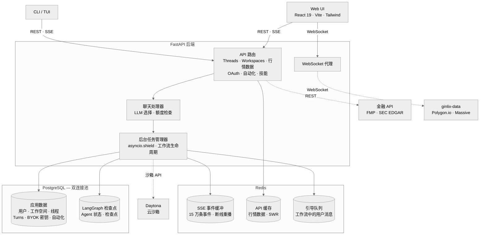
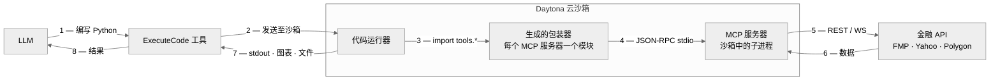
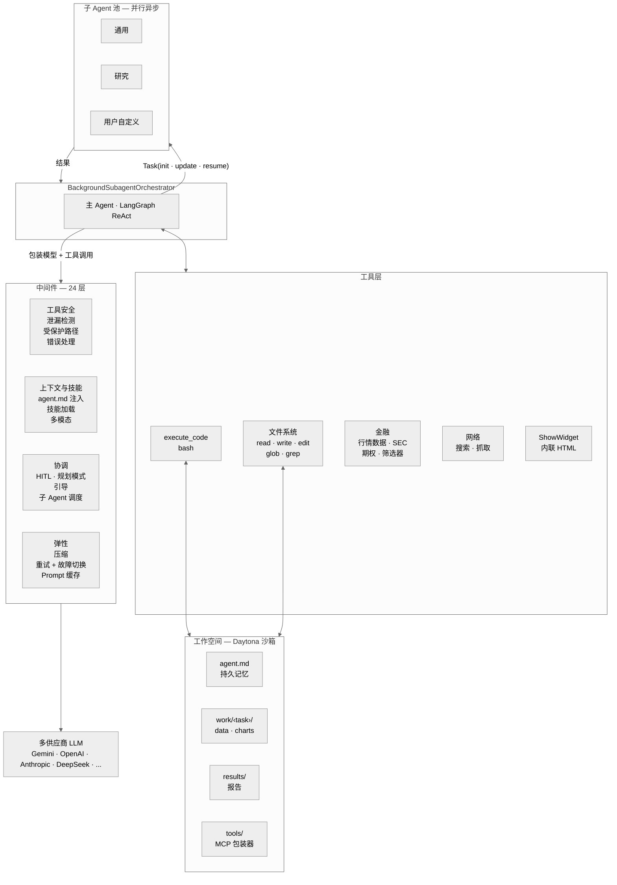

<p align="center">
  
  <br>
  <strong>一个 Vibe Investing 智能体框架</strong>
  <br>
  LangAlpha 旨在帮助解读金融市场，辅助投资决策。
  <br><br>
  
  <a href="https://github.com/langchain-ai/langchain"></a>
  
</p>

> [!NOTE]
> **Gemini 3 黑客松** — 如果您是 [Gemini 3 Hackathon](https://gemini3.devpost.com/) 的评审，请参阅 [`hackathon/gemini-3`](https://github.com/ginlix-ai/langalpha/tree/hackathon/gemini-3) 分支获取冻结的提交版本。当前 `main` 分支包含持续开发中的内容。

---

<p align="center">
  <a href="#快速开始">快速开始</a> &bull;
  <a href="docs/api/README.md">API 文档</a> &bull;
  <a href="src/ptc_agent/">Agent 核心</a> &bull;
  <a href="src/server/">后端</a> &bull;
  <a href="web/">前端</a> &bull;
  <a href="libs/ptc-cli/">TUI</a> &bull;
  <a href="skills/">技能</a> &bull;
  <a href="mcp_servers/">MCP</a>
</p>

<p align="center">
  <video src="https://github.com/user-attachments/assets/c3935d9a-73fd-4f34-bad8-af4c6233f355" autoplay loop muted playsinline width="900"></video>
</p>
<p align="center"><em>通过技能激活，Agent 调度并行子 Agent 收集市场数据、新闻和宏观背景，然后生成包含内联交互可视化的晨报。</em></p>

## 为什么选择 LangAlpha

如今，每一个 AI 金融工具都将投资视为一次性的：问一个问题，得到一个答案，然后结束。但真正的投资是贝叶斯式的——你从一个假设开始，每天都有新数据到达，你据此更新你的判断。这是一个跨越数周甚至数月的迭代过程：不断修正假设、重新审视仓位、在已有分析上叠加新的洞察。没有哪个单一 prompt 能捕捉这一切。

### *从 Vibe Coding 到 Vibe Investing*

灵感来自软件工程：代码库是持久的，每一次提交都建立在之前的基础之上。像 Claude Code 和 OpenCode 这样的代码 Agent 之所以成功，是因为它们构建了拥抱这种模式的 Agent——探索现有上下文，在已有工作的基础上继续构建。LangAlpha 带来了同样的洞见：给 Agent 一个持久的工作空间，研究自然会不断积累。

实际使用中，你为每个研究目标创建一个工作空间（"Q2 再平衡"、"数据中心需求深度研究"、"能源板块轮动"）。Agent 会就你的目标和风格进行访谈，产出第一份交付物，并将所有内容保存到工作空间文件系统中。明天回来，你的文件、对话线程和积累的研究成果仍然在那里。

## 功能亮点

- **渐进式工具发现** — 所有 MCP 工具以摘要形式加载到上下文中，完整文档则上传到工作空间，使 Agent 能够按需发现和使用工具。还支持通过技能绑定 JSON 工具，仅在技能激活时暴露给 Agent。
- **程序化工具调用 (PTC)** — Agent 编写并执行 Python 代码来处理来自 MCP 服务器的金融数据，而非将原始数据灌入 LLM 上下文窗口，从而在大幅减少 token 浪费的同时实现复杂的多步分析。
- **金融数据生态** — 多层数据供应商体系，原生工具用于快速查询，MCP 服务器用于沙箱中的批量数据处理、图表制作和多年分析。
- **持久化工作空间** — 每个工作空间映射到专属沙箱，具有结构化目录和持久记忆文件（`agent.md`），可跨会话和线程积累研究成果。
- **金融研究技能** — 预构建的工作流，涵盖 DCF 模型、首次覆盖报告、财报分析、晨报、文档生成等——可通过斜杠命令或自动检测激活。
- **金融研究工作台** — Web UI 支持内联金融图表、多格式文件查看器、TradingView 图表、实时 WebSocket 行情、可分享对话和子 Agent 监控。
- **多供应商模型层** — 与供应商无关的 LLM 抽象，错误时自动故障切换。
- **自动化** — 调度周期性或一次性任务，或设置价格触发自动化，当股票或指数达到实时价格条件时自动执行。
- **秘书模式** — Flash Agent 兼任秘书：创建和管理空间、在后台调度深度 PTC 分析、监控运行中的任务并获取结果——全部通过对话式命令完成，支持人工审批。
- **Agent 集群** — 并行异步子 Agent，具有隔离的上下文窗口、预加载的工具集/技能、执行中引导、基于检查点的恢复和 UI 中的实时进度监控。
- **实时引导** — 在 Agent/子 Agent 工作时发送后续消息来纠正方向、澄清或重定向，无需等待其完成。
- **中间件栈** — 24 个可组合层，处理技能加载、规划模式、多模态输入、自动压缩和上下文管理，支持长时间运行的 Agent 会话。
- **安全与工作空间保险库** — 通过 pgcrypto 实现静态加密、自动凭据泄漏检测和脱敏、沙箱化执行，以及按工作空间的密钥存储以实现安全的 Agent 访问。
- **渠道集成** — 通过 Slack、Discord 使用 LangAlpha，功能完整支持。
- **生产级基础设施** — SSE 流式传输 Agent 活动，具有 Redis 缓冲的断线重连回放、与 HTTP 连接解耦的后台执行，以及基于 PostgreSQL 的状态持久化。

## 技术架构

**系统架构**




### 多供应商模型层

LangAlpha 运行在与供应商无关的模型层上，抽象了多个 LLM 后端。无论哪个模型在驱动，相同的中间件栈、工具和工作流都能正常工作。它提供两种模式：

- **PTC 模式** 用于深度的、多步骤的投资研究。强大的推理能力驱动多步骤分析，Agent 规划其方法，思考金融数据，并编写代码进行复杂分析。长上下文使其能在单次运行中交叉引用 SEC 文件和研究报告。
- **Flash 模式** 用于快速对话响应和工作空间编排：快速市场查询、MarketView 中的图表聊天、轻量级问答，以及管理空间、在后台调度深度 PTC 分析并通过自然对话回传结果的秘书。

**自带模型** — 直接使用您现有的 AI 订阅和 API 密钥。通过 OAuth 连接 ChatGPT 或 Claude 订阅（OpenAI Codex OAuth、Claude Code OAuth），使用来自 Kimi（月之暗面）、GLM（智谱）或 MiniMax 的编程套餐，或通过 BYOK 为任何支持的供应商提供您自己的 API 密钥。所有密钥通过 PostgreSQL pgcrypto 静态加密（见[安全](#安全与工作空间保险库)）。

**模型弹性** — 同一模型上 3 次指数退避重试，然后自动故障切换到配置的备用模型。推理力度（`low`/`medium`/`high`）在不同供应商间自动归一化。

### 程序化工具调用 (PTC) 与工作空间架构

大多数 AI Agent 通过一次性 JSON 工具调用与数据交互，将结果直接放入上下文窗口。程序化工具调用翻转了这一模式：Agent 不再将原始数据传递给 LLM，而是在 [Daytona](https://www.daytona.io/) 云沙箱中编写并执行代码，本地处理数据并仅返回最终结果。这在大幅减少 token 浪费的同时，还能实现原本会超出上下文限制的分析。

**PTC 执行流程**




此外，工作空间环境使持久性超越了单个会话。每个沙箱具有结构化的目录布局——`work/<task>/` 用于每个任务的工作区域（数据、图表、代码），`results/` 用于定稿报告，`data/` 用于共享数据集——因此中间结果可以在会话之间保留。根目录中有 `agent.md`，这是 Agent 跨线程维护的持久记忆文件：工作空间目标、关键发现、线程索引和重要产物的文件索引。中间件层将 `agent.md` 注入每次模型调用，因此 Agent 始终拥有之前工作的完整上下文，无需重新读取文件。每个工作空间支持多个与单一研究目标关联的对话线程。

<p align="center">
  
</p>
<p align="center"><em>每个工作空间映射到一个持久沙箱——按主题、投资组合或研究假设组织研究。</em></p>

<p align="center">
  
</p>
<p align="center"><em>Agent 编写代码构建交互式仪表板——这里通过 PTC 分析 AI 计算供应链。</em></p>

### 金融数据生态

虽然 PTC 在多步数据处理、金融建模和图表创建等复杂工作中表现出色，但为每次数据查询启动代码执行未免大材小用。因此我们还构建了原生金融数据工具集，将常用数据转换为 LLM 可消化的格式。这些工具还附带直接在前端渲染的产物，为人工层面提供与 Agent 分析并排的即时可视化上下文。

**原生工具** 通过直接工具调用快速参考：

- **公司概览** 包含实时报价、价格表现、关键财务指标、分析师共识和营收构成
- **SEC 文件**（10-K、10-Q、8-K）包含财报电话会议记录和格式化 Markdown 用于引用
- **市场指数** 和 **板块表现** 提供广泛的市场背景
- **网页搜索**（Tavily、Serper、Bocha）和 **网页抓取**，具有熔断器容错机制

**MCP 服务器** 通过 PTC 代码执行消费原始数据：

- **价格数据** 提供股票、商品、加密货币和外汇的 OHLCV 时间序列
- **基本面** 提供多年财务报表、比率、增长指标和估值数据
- **宏观经济** 提供GDP、CPI、失业率、联邦基金利率、国债收益率曲线（1M–30Y）、国家风险溢价、经济日历和财报日历
- **期权** 提供带过滤的期权链、期权合约历史 OHLCV 和实时买卖盘快照

Agent 自动选择合适的层级：原生工具用于适合放入上下文的快速查询，MCP 工具用于需要批量数据处理、图表制作或沙箱中多年趋势分析的任务。

#### 数据供应商回退链

LangAlpha 支持三层数据供应商体系。每层都是可选的——当更高层级不可用时，系统会优雅降级：


| 层级 | 供应商                            | 所需密钥            | 增加的能力                                                                                   |
| ---- | --------------------------------- | ------------------- | -------------------------------------------------------------------------------------------- |
| 1    | **ginlix-data**（托管代理）       | `GINLIX_DATA_URL`   | 实时 WebSocket 行情推送、日内数据、盘前盘后数据、期权数据                                    |
| 2    | **FMP**（Financial Modeling Prep）| `FMP_API_KEY`       | 高质量基本面、财务报表、宏观数据、分析师数据                                                 |
| 3    | **Yahoo Finance**（yfinance）     | *无 — 免费*         | 价格历史、基本基本面、财报、持仓、内部交易、ESG、筛选器                                     |


所有层级默认启用。若要仅使用**免费数据**（Yahoo Finance）运行，请运行 `make config` 在交互提示中选择。您也可以手动编辑 `agent_config.yaml`。

> [!NOTE]
> Yahoo Finance 数据来源于社区，存在限制：日内数据不低于 1 小时间隔、报价延迟、宏观覆盖有限、偶尔有速率限制。强烈建议获取 `FMP_API_KEY`（[提供免费套餐](https://site.financialmodelingprep.com/)）。

<p align="center">
  
</p>
<p align="center"><em>原生金融数据工具在 Agent 进行可比公司分析时内联渲染实时股票卡片。</em></p>

### 金融研究技能

Agent 内置 23 个预构建金融研究技能，每个都可通过斜杠命令或自动检测激活。技能遵循 [Agent Skills 规范](https://agentskills.io/specification)，可通过在工作空间中放置 `SKILL.md` 文件来扩展。


| 类别                 | 技能                                                                                      |
| -------------------- | ----------------------------------------------------------------------------------------- |
| **估值与建模**       | DCF 模型、可比公司分析、三表模型、模型更新、模型审计                                      |
| **股票研究**         | 首次覆盖（30-50页报告）、财报前瞻、财报分析、假设追踪                                    |
| **市场情报**         | 晨报、催化剂日历、板块概览、竞争分析、观点生成                                           |
| **文档生成**         | PDF、DOCX、PPTX、XLSX — 创建、编辑、提取                                                 |
| **运营**             | 投资演示文稿质检、定时自动化、用户画像与投资组合                                         |


致谢：部分技能改编自 [anthropics/financial-services-plugins](https://github.com/anthropics/financial-services-plugins)。

<p align="center">
  
</p>
<p align="center"><em>可比公司分析技能构建包含运营指标和估值倍数的多工作表 Excel 工作簿。</em></p>

### 多模态智能

Agent 原生支持读取图像（PNG、JPG、GIF、WebP）和 PDF——多模态中间件拦截文件读取，从沙箱或 URL 下载内容，并将其作为 base64 注入对话以进行直接视觉解读。在 MarketView 中，用户的实时 K 线图可以被捕获并作为多模态上下文发送给 Agent——捕获内容包括图表图像和结构化元数据（标的代码、时间周期、OHLCV、移动平均线、RSI、52 周范围），因此 Agent 可以同时分析视觉形态和底层数据。

<p align="center">
  
</p>
<p align="center"><em>MarketView 捕获实时图表并发送给 Agent 进行实时技术分析。</em></p>

### 自动化

Agent 可以在对话中自行调度任务——无需单独的 UI。用户也可以从专属的自动化页面管理自动化，支持完整 CRUD、执行历史和手动触发。所有自动化类型共享相同的 `AutomationExecutor`，可配置 Agent 模式（PTC 或 Flash），并在连续失败后自动禁用。

**定时触发** — 标准的 cron 表达式用于周期性调度（"每周一上午 9 点运行此分析"）和一次性日期时间调度用于单次未来执行。

**价格触发** — 在任何股票或主要指数上设置价格目标或百分比变动，当条件满足时 Agent 立即执行您的指令。`PriceMonitorService` 订阅共享的上游 WebSocket 连接到 [ginlix-data](https://github.com/ginlix-ai/ginlix-data) 以获取实时报价（股票使用实时层级，指数使用延迟层级）。基于 Redis 的去重机制防止跨服务器实例的重复触发。


| 条件                 | 示例                                            |
| -------------------- | ----------------------------------------------- |
| 价格上穿 / 下穿      | 当 AAPL 突破 $200 时触发                        |
| 涨跌幅上穿 / 下穿    | 当 SPX 从前收盘价变动 +2% 时触发                 |


条件可以组合（AND 逻辑），每个价格自动化支持**一次性**（触发一次）或**周期性**模式，具有可配置的冷却时间（最少 4 小时，或默认每个交易日一次）。

> [!NOTE]
> 价格触发自动化需要 ginlix-data 的实时 WebSocket 数据流。在测试期间，此功能仅在[托管平台](https://ginlix.ai)上可用。更广泛的 WebSocket 数据源支持计划在未来版本中提供。

<p align="center">
  
</p>
<p align="center"><em>调度周期性研究——这里为大型科技股的财报前分析在每次报告前自动运行。</em></p>

**Agent 架构**




### Agent 集群

核心 Agent 运行在 [LangGraph](https://github.com/langchain-ai/langgraph) 上，通过 `Task()` 工具生成并行异步子 Agent。子 Agent 并发执行，具有隔离的上下文窗口，防止长推理链中的漂移。每个子 Agent 将综合结果返回给主 Agent，保持协调器的轻量。主 Agent 可以选择等待子 Agent 的结果或继续其他待处理工作。中断主 Agent 不会停止正在运行的子 Agent，因此您可以暂停协调器、更新需求或在现有子 Agent 在后台完成时调度额外的子 Agent。您还可以在 UI 中切换到**子 Agent** 视图实时查看它们的进度（仅限 Web 前端）。

除了简单的调度，主 Agent 还可以通过 `Task(action="update")` 向仍在运行的子 Agent 发送后续指令，或通过 `Task(action="resume")` 恢复已完成的子 Agent（具有完整的检查点上下文）进行迭代优化。如果服务器重启，子 Agent 状态会从 LangGraph 检查点自动重建。

<p align="center">
  
</p>
<p align="center"><em>三个研究子 Agent 并行运行，每个覆盖不同的芯片系列——结果合并为一个交互式时间线。</em></p>

### 中间件栈

Agent 内置中间件栈，包括：

- **实时引导** — Agent 可能走弯路、追逐无关数据或在分析中误解您的意图。引导让您无需等待即可纠正方向。在 Agent 工作时随时发送后续消息——更新的指令、澄清或全新的问题——中间件会在下一次 LLM 调用前将其注入对话。Agent 像实时收到一样看到您的消息，调整计划并从那里继续。引导在每个层级都有效：重定向主 Agent、通过 `Task(action="update")` 向单个后台子 Agent 发送后续指令，或让系统在工作流完成前优雅地将未消费的消息返回到您的输入框。没有工作丢失，无需重启。
- **动态技能加载** 通过 `LoadSkill` 工具让 Agent 按需发现并激活技能工具集，保持默认工具表面精简，同时在需要时提供专业能力
- **多模态** 拦截图像和 PDF 的文件读取，从沙箱或 URL 下载内容，并将其作为 base64 注入对话，使多模态模型能够原生解读
- **规划模式** 通过人工审批中断让您在执行前审查和批准 Agent 的策略
- **自动压缩** 在接近 token 限制时压缩对话历史，保留关键上下文同时释放空间
- **上下文管理** 自动将超过 40,000 token 的工具结果卸载到工作空间文件系统，在上下文中保留截断预览。对于超长会话，双层压缩系统首先截断旧的工具参数，然后由 LLM 摘要对话历史，同时将完整转录卸载到工作空间以供恢复。研究会话可以无限期运行而不触及 token 限制。

详见 [`src/ptc_agent/agent/middleware/`](src/ptc_agent/agent/middleware/) 获取完整列表。

致谢：部分中间件组件改编或灵感来自 [LangChain DeepAgents](https://github.com/langchain-ai/deepagents) 的实现。

### 流式传输与基础设施

服务器通过 SSE 流式传输所有 Agent 活动：文本块、带参数和结果的工具调用、子 Agent 状态更新、文件操作产物和人工审批中断。每一个 Agent 决策都可以在 UI 中完整追踪。

工作流作为独立的后台任务在 `asyncio.shield()` 后运行，完全与 HTTP/SSE 连接解耦。即使浏览器标签页关闭或网络中断，Agent 仍继续工作。重新连接时，最多 15 万条缓冲事件从 Redis 中通过 `last_event_id` 去重重播，精确从客户端断开的位置继续。后台清理任务在一小时后自动清除被遗弃的工作流。软中断暂停主 Agent，同时后台子 Agent 继续运行。

PostgreSQL 支持 LangGraph 检查点、对话历史和用户数据（关注列表、投资组合、偏好），因此 Agent 状态和用户上下文在会话之间持久存在。Redis 缓冲 SSE 事件，使浏览器刷新和网络中断不会丢失传输中的消息：客户端重新连接并自动重播。服务器还处理本地数据和沙箱数据之间的同步，保持 MCP、技能和用户上下文同步。详见完整的 [API 参考](docs/api/README.md)。

## 安全与工作空间保险库

LangAlpha 在凭据、代码执行和用户提供的密钥方面采用分层安全模型。

**静态加密** — 所有敏感数据（BYOK API 密钥、OAuth 令牌、保险库密钥）使用 `pgcrypto`（`pgp_sym_encrypt` / `pgp_sym_decrypt`）在 PostgreSQL 内部加密。明文永远不会存在于数据库或应用持久化时的内存中。

**凭据泄漏检测** — 每个工具输出在到达 LLM 上下文之前都会被扫描。中间件解析所有已知的密钥值（MCP 服务器密钥、沙箱令牌、保险库密钥），并将任何匹配项脱敏为 `[REDACTED:KEY_NAME]`。同样的脱敏应用于面向人类的界面——文件读取和下载在到达客户端之前被清理。

**沙箱化代码执行** — 每个工作空间在自己的 [Daytona](https://www.daytona.io/) 云沙箱中运行，具有专属的文件系统和网络边界。受保护路径守卫阻止 Agent 访问内部系统目录——同时阻止工具输入（在执行前短路调用）和工具输出（脱敏泄漏的路径）。

### 工作空间保险库

每个工作空间内置密钥保险库，用于存储 Agent 在代码执行期间可以使用的 API 密钥和凭据——适用于访问第三方数据源（券商 API、外部数据供应商等）或在工作空间内构建 LLM 驱动的工作流。在 UI 中存储一次密钥，它就可以通过简单的 Python API 供该工作空间的每个 Agent 会话使用：

```python
from vault import get, list_names, load_env

api_key = get("MY_API_KEY")       # 获取单个密钥
names = list_names()               # 列出可用密钥名称
load_env()                         # 批量加载所有密钥为环境变量
```

保险库密钥继承上述所有保护层——静态加密、从所有 Agent 和面向人类的输出中脱敏，以及阻止直接文件访问。只有工作空间所有者才能创建、更新、查看或删除密钥。

## 前端

Web UI 不仅仅是一个聊天界面——它是一个完整的研究工作台：

- **内联金融图表** — 工具结果直接在聊天线程中渲染为交互式迷你图、柱状图和概览卡片
- **内联 HTML 小部件** — Agent 可以通过 `ShowWidget` 工具直接在聊天中渲染交互式 HTML/SVG 可视化（Chart.js 图表、指标卡片、数据表格），具有主题感知样式和沙箱化 iframe
- **多格式文件查看器** — PDF（分页、可缩放）、Excel、CSV、HTML 预览和源代码（带差异模式的 Monaco 编辑器）——全部内联查看，无需下载
- **TradingView 图表** — 完整的 TradingView 高级图表，具有绘图工具、指标和专业 K 线样式
- **实时行情数据** — 实时 WebSocket 行情推送，1 秒级报价分辨率、盘前盘后可视化和多个移动平均线叠加
- **可分享对话** — 一键分享，具有精细权限（切换文件浏览和下载访问），通过公开 URL 重播
- **实时子 Agent 监控** — 实时观看每个后台任务的流式输出和工具调用，并能发送执行中指令
- **自动化** — CRUD 管理，具有 cron 构建器、执行历史、手动触发，以及当股票或指数达到实时价格条件时触发的价格自动化

<p align="center">
  
</p>
<p align="center"><em>仪表板一目了然地呈现市场指数、个性化新闻、投资组合跟踪和即将到来的财报。</em></p>

## 渠道集成

从您已经在使用的工具中使用 LangAlpha。集成网关在消息平台和核心 Agent 之间中继消息，每个渠道以其原生格式接收响应。渠道集成仅在托管服务上提供，支持一键设置和快速账户绑定——访问 [集成页面](https://ginlix.ai/account/integrations) 开始使用。


| 功能                           | Slack | Discord | 飞书 | Telegram | WhatsApp |
| ------------------------------ | ----- | ------- | ---- | -------- | -------- |
| 富文本 / Markdown              | ✅     | ✅       | ✅    | ✅        | 🔜       |
| 文件上传（用户 → Agent）       | ✅     | ✅       | ✅    | ❌        | ➖        |
| 文件下载（Agent → 用户）       | ✅     | ✅       | ✅    | ❌        | ➖        |
| 图像渲染                       | ✅     | ✅       | ✅    | ❌        | ➖        |
| 人工审批中断                   | ✅     | ✅       | ✅    | ⚠️       | ➖        |
| 子 Agent 追踪                  | ✅     | ✅       | ✅    | ✅        | 🔜       |
| 工作空间 / 模型选择            | ✅     | ✅       | ✅    | ✅        | 🔜       |
| 自动化推送（出站）             | ✅     | ✅       | ❌    | ➖        | ➖        |
| 简化账户绑定                   | ✅     | ✅       | ❌    | ❌        | ➖        |
| 斜杠命令                       | ✅     | ✅       | ✅    | ✅        | ➖        |


Slack 和 Discord 提供原生渠道和线程级分组，天然映射到 LangAlpha 工作空间和线程——上下文管理是原生的。Telegram 和 WhatsApp 缺少这些原语，因此运行简化的编排模式。飞书具有完整的消息和卡片式 UI，OAuth 即将推出。Telegram 有部分支持，完整覆盖即将推出。WhatsApp 已规划。

## 快速开始

> [!TIP]
> **不想自托管？** 试试[托管版本](https://ginlix.ai)——它开箱即用包含完整的数据基础设施（FMP、实时行情、云沙箱）。自带 LLM 密钥（BYOK），无需设置即可立即开始。

您只需 **Docker** 即可启动 LangAlpha——无需数据 API 密钥，无需云沙箱。只需 Docker 用于基础设施，加上您自己的 LLM 订阅用于 AI 模型。

```bash
git clone https://github.com/ginlix-ai/langalpha.git
cd langalpha
make config   # 交互式向导 — 创建 .env，配置 LLM、数据源、沙箱和搜索
make up       # 启动 PostgreSQL、Redis、后端和前端
```

- **前端：** [http://localhost:5173](http://localhost:5173)
- **后端 API：** [http://localhost:8000](http://localhost:8000)（交互式文档在 `/docs`）
- **验证：** `curl http://localhost:8000/health`

如需完整体验，向导会提示您输入可选密钥——或稍后添加到 `.env`：


| 密钥                                  | 解锁的功能                                                                                                    |
| ------------------------------------ | ------------------------------------------------------------------------------------------------------------- |
| `DAYTONA_API_KEY`                    | 持久云沙箱，支持跨会话工作空间 ([daytona.io](https://www.daytona.io/))                                        |
| `FMP_API_KEY`                        | 高质量基本面、宏观、SEC 文件、期权（[提供免费套餐](https://site.financialmodelingprep.com/)）                  |
| `SERPER_API_KEY` 或 `TAVILY_API_KEY` | 网页搜索                                                                                                      |
| `LANGSMITH_API_KEY`                  | 追踪和可观测性                                                                                                |


> [!NOTE]
> 没有外部服务密钥，您将获得功能完整但体验受限的版本：Yahoo Finance 提供免费的价格历史、基本面、财报和分析师数据，但缺少实时报价、日内分时数据、宏观经济和期权分析。Docker 沙箱替代 Daytona 云沙箱——完整的 PTC 代码执行可用，但安全性和隔离性有所降级。可以逐步添加密钥以解锁更多功能。

运行 `make help` 查看所有可用命令。如需不使用 Docker 的手动设置，请参阅 [CONTRIBUTING.md](CONTRIBUTING.md#manual-setup)。

## 文档

- **[API 参考](docs/api/README.md)** 包含聊天流式传输、工作空间、工作流状态等端点
- **交互式 API 文档** 在服务器运行时位于 `http://localhost:8000/docs`

## 联系方式

如需合作、协作或一般咨询，请联系 [contact@ginlix.ai](mailto:contact@ginlix.ai)。

## 免责声明

LangAlpha 是一个研究工具，而非财务顾问。本软件产生的任何内容均不构成投资建议、推荐或买卖任何证券的邀请。所有输出仅供信息和教育目的。使用时请自行判断——在做出投资决策前，请务必进行自己的尽职调查。

## 许可证

Apache License 2.0
